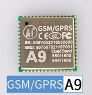
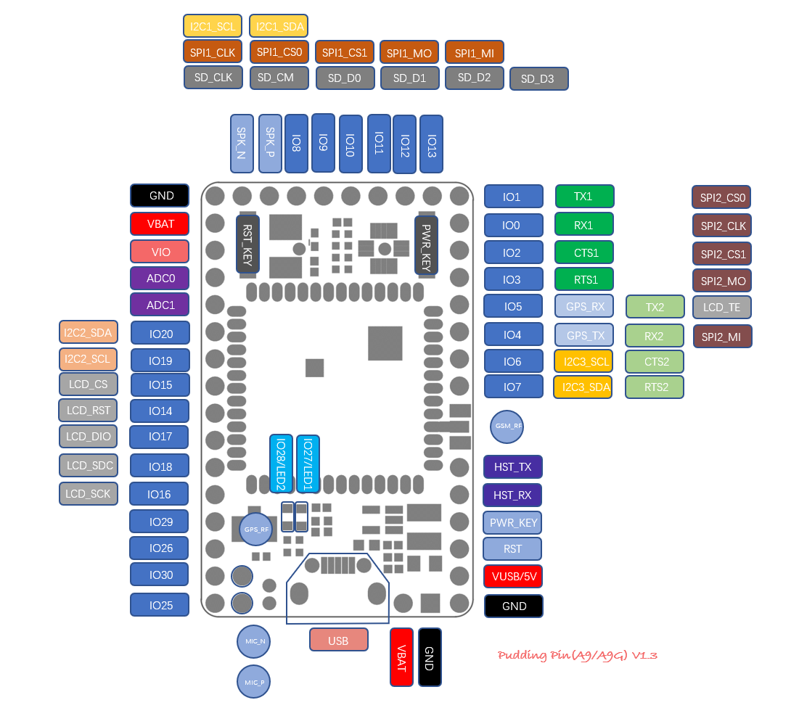

[Ai-Thinker GPRS C SDK](https://github.com/Ai-Thinker-Open/GPRS-C-SDK)
=====

Ai-Thinker GPRS SoC development SDK written by C

安信可GPRS模组片上(SoC)开发SDK C语言版

> This SDK can be also applied to RDA8955 raw chip
> 也可直接在RDA8955芯片上运行

[English Readme](./README_EN.md)

[](http://isitmaintained.com/project/ai-thinker-open/gprs_c_sdk "Average time to resolve an issue") [](http://isitmaintained.com/project/ai-thinker-open/gprs_c_sdk "Percentage of issues still open")

## (一) 硬件

### 1. A9: GPRS 模块

</br>

##### 特征

  * 32位内核，主频高达312MHz，4k指令缓存，4k数据缓存
  * 多达29个GPIO（两个GPIO作为下载口）
  * 实时时钟、闹钟
  * 1个USB1.1接口
  * 2个带流控的UART接口（+1个下载调试串口）
  * 2个SPI接口
  * 3个I<sup>2</sup>C接口
  * 1个SDMMC控制器（接口）
  * 2个10位ADC接口
  * 32Mb(4MB) SPI NOR Flash
  * 32Mb(4MB) DDR PSRAM
  * 8kHz、13Bits/sample ADC mic
  * 48kHz、16bits/sample DAC Audio
  * 电源管理单元：锂电池充电管理、集成DC-DC及LDOs、可变化的IO电压
  * 18.8 x 19.2 mm SMD封装
  * 四频GSM/GPRS（800/900/1800/1900MHz)
  * 语音通话
  * 短信服务

### 2. A9G: GPRS+GPS+BDS模块
 
</br>

##### 特征

  * A9所有特征
  * 集成GPS+BDS(内部和GPRS串口2连接)

### 3. A9/A9G GPRS(+GPS+BDS) 开发板

</br>

A9/A9G开发板，方便开发和调试

##### 特征

  * 1个A9G模块（A9和A9G采用相同封装，引脚相同,所以开发板通用）
  * 引出模块29个GPIO（包括2个下载调试引脚（`HST_TX`,`HST_RX`）
  * 1个SIM卡（Micro卡）卡槽(Nano卡<Micro卡<标准卡)
  * 1个TF卡卡槽
  * 1个GPRS IPEX1代座子
  * 1个GPS  IPEX1代座子
  * 一个USB接口
  * 5v-4.2V DC-DC，故可以5v供电或者3.8~4.2V供电
  * 1个加速度计LIS3DHx芯片（购买时请咨询客服开发板有无加速度计,默认没有）
  * 1个开机按键，1个复位按键
  * 2个连接到GPIO的LED灯
  * 1个麦克风

##### pudding开发板引脚图

</br>

>  RDA8955芯片或者其相关模块理论上也可使用本SDK

### 4. USB转串口模块


需要注意的是，开发板上的USB接口不是USB转串口功能，而是USB1.1功能， 
所以，为了下载和调试，需要一个USB转串口模块接板子上的`HST_TX`和`HST_RX`引脚

### 5. 电源

* 可以用锂电池来给模块供电，接VBAT(3.4~4.2V),VBAT供电需要长按(拉低)<kbd>power-key</kbd>开机;
* 开发板也可使用5V接VUSB经过开发板的DC-DC降压后供电，USB转串口模块直接供电也行(仅调试)，要保证有足够的电流供应(峰值2A),
因为VUSB接了电所以模块上电会自动开机


## (二) SDK特征

1. 提供易用的API，只要有C语言开发基础就可以快速使用，并提供详细的[例程](https://github.com/Ai-Thinker-Open/GPRS_C_SDK/tree/master/demo)和[文档](https://ai-thinker-open.github.io/GPRS_C_SDK_DOC/zh/)
2. 集成大量功能，包括：
    * GPIO
    * UART
    * 基础信息获取如ICCID、IMEI、IMSI等
    * SPI
    * I2C
    * ADC
    * OS
    * FS
    * GPRS网络(包括基站信息查询)
    * 基站定位（LBS）
    * socket(TCP/UDP)
    * dns
    * SSL/TLS
    * MQTT
    * 短信
    * 通话
    * 低功耗
    * GPS
    * RTC、基站时间同步
    * FOTA
    * 看门狗
    * 音频播放(如播放MP3)
    * 机智云平台快速接入
    * 阿里云CSDK
    * 其它库如json、NMEA解析库等等，具体可以看`demo`目录或者`libs`目录

#### 获得SDK

代码托管在[github](https://github.com/Ai-Thinker-Open/GPRS-C-SDK)上

##### 1. 下载代码

需要**注意**的是：**请勿使用本页面右上角的绿色<kbd>Clone or download</kbd>按钮**下载的压缩包，否则编译会报文件缺失的错误

---

* 方法一：从github[发布页面下载最新发布的压缩包](https://github.com/Ai-Thinker-Open/GPRS_C_SDK/releases)（**推荐**）。
  > 这种方式获取的代码的发布的版本


---
* 方法二：使用如下命令克隆工程到本地（需先安装`git`，**注意克隆时需要加`--recursive`参数**，不然获得的SDK文件不全）。
  > 这种方式可以得到最新的还未发布的代码
```
git clone https://github.com/Ai-Thinker-Open/GPRS_C_SDK.git --recursive
```
---
##### 2. 检查代码完整性

下载完后请检查目录`platform/csdk`目录写是否包含`debug`、`release`目录。
如果没有，则是下载方式错误，请仔细阅读第一步下载正确的文件


## (三) 开发文档及例程


**文档地址： [GPRS C SDK 在线文档](https://ai-thinker-open.github.io/GPRS_C_SDK_DOC/zh/)**

包括开发环境安装、固件下载、调试以及GPRS基础知识、API说明等

例程在本项目的[demo](./demo)目录下


## (四) 反馈

在[这里(issue)](https://github.com/Ai-Thinker-Open/GPRS_C_SDK/issues?utf8=%E2%9C%93&q=)可以查看搜索正在讨论或者已经解决的问题

反馈方式：

* 方式一：github [添加issue](https://github.com/Ai-Thinker-Open/GPRS-C-SDK/issues/new)

* 方式二：[安信可论坛讨论](http://bbs.ai-thinker.com/forum.php?mod=forumdisplay&fid=37)

* 右上角★<kbd>Star</kbd>一个不会迷路哦,下次方便找到哦~


## (五) 参与开发

**bug修复、优化、功能模块增加**： fork -> 修改 -> 提交PR


