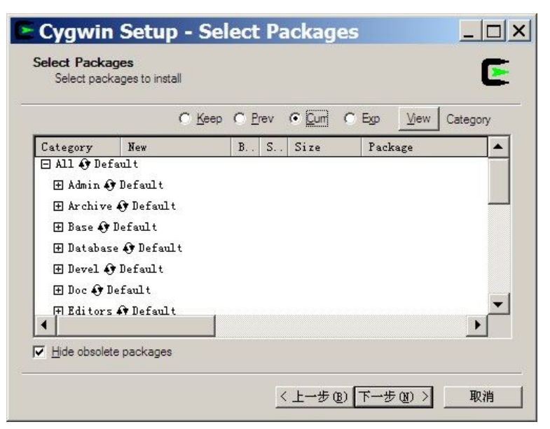

[GPRS C SDK 开发环境搭建](https://github.com/Ai-Thinker-Open/GPRS-C-SDK/blob/master/doc/compile_environment_zh-cn.md)
====

## 1. 下载工具链以及下载调试工具

* [下载CSDTK3.8](http://otge8q9ud.bkt.clouddn.com/CSDTK3.8_Cygwin1.5.25_Svn_1.5.4_Full_Setup.exe)

* [下载cooltools](http://otge8q9ud.bkt.clouddn.com/cooltools-win32_custom-2017-11-01-16-20-d9846481.7z)

## 2. 安装CSDTK（编译链接库）

并安装，安装时使用**英文无空格**路径，第一次安装建议使用默认路径，熟悉之后再定制
安装时按照指示选择选项并点击<kbd>下一步</kbd>,主要**注意**的是:
在安装cygwin时，选择从本地安装，选择unix风格，安装到`CSDTK/cygwin`目录中，如图：


选择包直接点击下一步



## 3. 更新cooltools

删除CSDTK\cooltools目录下的文件，解压`cooltools*.7z`替换到CSDTK\cooltools.

## 4. 设置变量

* 编辑`CSDTK/cygwin/.bashrc`文件
  * 修改`export PROJ_ROOT=`cygpath "C:\projects"``，这里`C:\projects`改成放工程的目录，比如这里`C:\projects`下有`GPRS-C-SDK`项目目录和`GPRS-C-SDK2`项目目录
  * 改`export PATH`中的cooltools目录(比如`/cygdrive/C/CSDTK/cooltools`)
  * 保存关闭，重新打开cygwin即生效

> 如果遇到权限问题，用管理员权限运行脚本`CSDTK/cygwin/Cygwin.bat`，用类似如下的命令改变csdk项目目录的权限, `chmod 777 -R /cygdrive/d/csdk/`


## 5. 编译

* **编译**
环境搭建完成后，尝试打开cygwin，输入
```
work gprs-c-sdk
./build.sh demo gpip
```
进行编译，编译会生成一个`build`目录，编译完成会在`hex`目录下生成两个格式为`lod`的文件，这就是我们用来下载到开发板的目标文件

* **目标文件说明** 

两个文件一大一小，在第一次下载时需要下载大文件(`*_B*.lod`)即可，第二次和以后都只需要下载小文件(`*_flash.lod`)即可，更新SDK后也需要重新下载大文件

## 6. 其它问题

如果仍然有错，请根据错误提示仔细检查上面的步奏，再不行，可以到安信可论坛提问或者github提交issue

* 方式一：github[添加issue](https://github.com/Ai-Thinker-Open/GPRS-C-SDK/issues/new)

* 方式二：[安信可论坛讨论](http://bbs.ai-thinker.com/forum.php?mod=forumdisplay&fid=37)
