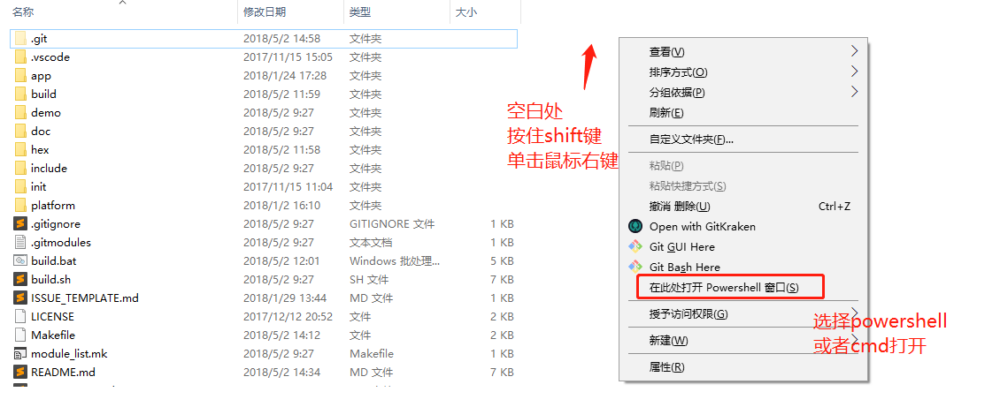

[GPRS C SDK 开发环境搭建](https://github.com/Ai-Thinker-Open/GPRS-C-SDK/blob/master/doc/compile_environment_zh-cn.md)
====

## 0.注意

* **注意（重要，请先阅读）**
SDK没有特定的IDE，用户自己选择代码编辑器编辑代码。
在修改代码时，一定不能使用windows自带的记事本和写字板，请使用更加专业的编辑器(推荐使用如[vscode](https://code.visualstudio.com/)，[sublime](https://www.sublimetext.com/)，[atom](https://atom.io/)，[eclipse](http://www.eclipse.org/downloads/packages/eclipse-ide-cc-developers/oxygen2)等，或者其它你熟悉的编辑器。)
同时，请修改编辑器设置，文件结尾符号设置为unix风格(`<LF>`(`\n`)结尾)(设置方法请自行到网络查找)
同时，如果你是使用git进行克隆，请设置git在pull时不将`<LF>`转换为`<CR><LF>`，设置方法参考[这里](https://www.jianshu.com/p/305a138883d4)

## 1. 下载工具链以及下载调试工具及SDK

* 下载CSDTK4.2：[百度云下载](https://pan.baidu.com/s/1Oa5tvWW2Flfl5UJITk980g)

* [下载SDK](https://github.com/Ai-Thinker-Open/GPRS_C_SDK/releases), 然后解压为`GPRS_C_SDK`文件夹放到某个目录下

## 2. 解压CSDTK文件（编译链接下载调试工具），并安装

* 解压到某个文件夹,比如`C:\CSDTK`
* 运行CSDTk目录下的`config_env_admin.bat`文件


## 3. 编译

解压CSDK工程目录到`GPRS_C_SDK`目录，按住shift，鼠标右键单击，选择cmd打开或者powershell打开，如图：

然后使用`build.bat`脚本来编译工程，有以下参数：
  * 使用 `./build.bat $PROJ`来编译你的应用模块，如 `./build.batsh app` 则是编译app目录下的源码
  * 使用 `./build.bat demo $PROJ` 来编译demo目录下的特定例程
  * 使用 `./build.bat clean $PROJ` 清除`$PROJ`目录的中间文件
  * 使用 `./build.bat clean all` 清除所有中间文件
  * 使用 `./build.bat demo $PROJ release` 来生成release版本，比如`./build.bat demo gpio release`，
  如果最后一个参数不是`release`，则默认是`debug`版本， `debug`版本在死机后会停止运行并可以使用GDB调试，而**release版本在死机时会自动重启系统**，所以实际投入使用时请使用release版本，测试时使用debug版本

**比如：**
```
./build.sh demo gpio
```
进行编译，编译会生成一个`build`目录，编译完成会在`hex`目录下生成两个格式为`lod`的文件，这就是我们用来下载到开发板的目标文件

* **目标文件说明** 

两个文件一大一小，在第一次下载时需要下载大文件(`*_B*.lod`)即可，第二次和以后为了减少下载时间都只需要下载小文件(`*_flash.lod`)即可，更新SDK后也需要重新下载大文件

## 6. 其它问题

* 如果遇到问题，请仔细对比文档，看操作是否有错，也可以在[issue](https://github.com/Ai-Thinker-Open/GPRS_C_SDK/issues?utf8=%E2%9C%93&q=)里找有没有先例，如果仍然有错，可以到安信可论坛提问或者github提交issue

* 方式一：github[添加issue](https://github.com/Ai-Thinker-Open/GPRS-C-SDK/issues/new)

* 方式二：[安信可论坛讨论](http://bbs.ai-thinker.com/forum.php?mod=forumdisplay&fid=37)
