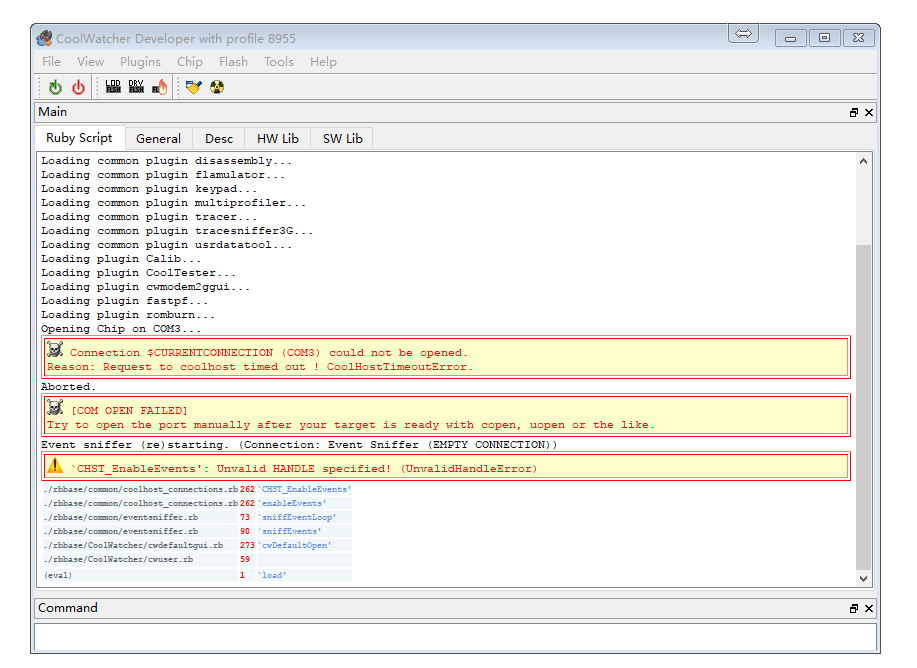

[GPRS 下载调试说明](https://github.com/Ai-Thinker-Open/GPRS-C-SDK/blob/master/doc/download_debug_tool_zh-cn.md)
======


## 硬件连接

* 模块的调试下载接口是`HST`接口，即引脚`HST_RX`和`HST_TX`脚分别连接连接USB转串口模块的`TX`和`RX`引脚（交叉连接,`HST_RX`接`TX`）

* 电源可以接锂电池电压（即3.8v~4.2v）（VBAT引脚）,也可以接5v电源（5v输入引脚或者USB输入），需要注意的是，如果使用锂电池供电，上电后需要按<kbd>POWER KEY</kbd>3秒左右让模块开机，USB供电则会上电自动开机。 在下载或者调试时要确保已经开机。

## 下载步骤
* 将`coolwatcher更新到最新版本`(coolwatcher在CSDTK文件夹下)
* 打开`CSDTK/cooltools/coolwatcher.exe`

* 左边`profiles`选项选择`8955`，右边需要设置`lastcomport`为连接模块下载调试串口(`HST`)的端口</br>
</br>
点击Ok

* 等待连接成功，出现以下界面</br>
</br>
> 如果出现连接失败的情况，请参考 [coolwatcher 无法连接原因](#coolwatcher无法连接)部分


* 如果第一次使用，需要点击<kbd>DRY</kbd>图标，选择名字包含` 8955 ramrun spi32m .lod`的文件（在工程`platform/ramrun`下或者coolwatcher `cooltools\chipgen\Modem2G\toolpool\plugins\fastpf\flash_programmers`目录下）。
只需要设置一次，后面都会记住的
* 点击下图中的<kbd>lod</kbd>图标，选择编译生成的固件，在工程hex目录下`.lod`格式的文件，首次下载下载文件体积较大的`.lod`格式文件，后面为了加快下载速度只需要下载体积较小的固件文件即可
* 点击 <kbd>download</kbd>图标，进行下载，正常效果如下图，右下角Command栏会有进度标志</br>
</br>
> 如果下载失败，请参考 [coolwatcher 下载失败原因](#coolwatcher无法下载)部分


## coolwatcher无法连接



解决方法：

* 保证串口和模块已经连接（注意开发板上的USB口不是串口，下载串口是通过USB转串口模块连接`HST_RX` 和 `HST_TX`引脚）

* 保证串口没有被其它软件占用

* 检查串口号是否选择错误，重新启动的时候设置串口号，或者不重启 点击右下角<kbd>CoolHost</kbd>图标来设置</br>


然后点击<kbd>connect</kbd>重新连接串口

## coolwatcher无法下载


* [ramrun文件错误](https://github.com/Ai-Thinker-Open/GPRS_C_SDK/issues/1)，分别尝试使用工程目录`platform/ramrun`下 和 coolwatcher `CSDTK\cooltools\chipgen\Modem2G\toolpool\plugins\fastpf\flash_programmers`目录下的`*_8955_*_spi32m_ramrun.lod`

* 有可能程序进入了休眠模式，按模块复位键复位后再下载

* 串口有可能掉了，任务栏右下角双击<kbd>CoolHost</kbd>图标重新连接串口，再下载

* 串口其它问题，拔掉USB转串口模块重新插入电脑，再进行上一步重新连接串口

* 程序中开机就进入了睡眠模式 或者 有线程使用了`while(1)`死循环而且完全占用了资源，比如:
```
void LoopTask(VOID *pData)
{
    uint64_t count = 0;
    while(1)
    {
        ++count;
        if(count == 3000)
        {
            count = 0;
            Trace(1,"Test Test");
        }
    }
}
```
**解决：** 按下模块复位键，在USB转串口模块数据传输指示灯闪烁（即模块已经启动并向串口发送数据）的一瞬间按下下载按钮即可，不行就多试几次
为了彻底防止这种问题，建议不要写这种程序，在循环中最好使用时间触发或者至少延时`OS_Sleep()`)一下
```
void LoopTask(VOID *pData)
{
    uint64_t count = 0;
    while(1)
    {
        ++count;
        if(count == 3000)
        {
            count = 0;
            Trace(1,"Test Test");
            OS_Sleep(100);
        }
    }
}
```
或
```
void LoopTask(VOID *pData)
{
    uint64_t count = 0;
    while(1)
    {
        ++count;
        if(count == 3000)
        {
            count = 0;
            Trace(1,"Test Test");
            
        }
    }
    OS_Sleep(1);
}
```
或 事件处理
```
void AppMainTask(VOID *pData)
{
    API_Event_t* event=NULL;
        
    while(1)
    {
        if(OS_WaitEvent(mainTaskHandle, &event, OS_TIME_OUT_WAIT_FOREVER))
        {
            EventDispatch(event);
            OS_Free(event->pParam1);
            OS_Free(event);
        }
    }
}
```


## 调试

#### Tracer基本介绍及使用


* 查看debug信息：打开`Plugins`->`Active Tracer`，界面及功能如下图


使用前需要设置Tracer，设置如下如1~6步：


* 程序中需要输出调试信息可以调用`api_debug.h`中的`Trace(uint16_t nIndex,PCSTR fmt, ...)`函数，其中 `nIndex`就是对应tracer设置中的`MMI 01` ~ `MMI 16`

#### Tracer使用容易遇到的问题

* 有时候自己期望的调试数据没有显示，有可能是点了右上角的暂停显示最新的按钮，忘了关闭！！


#### 死机处理

这里模拟了一个异常，空指针赋值的异常，一般出现这种问题都是指针乱飞的问题！
打开GBD，并设置选择elf文件


打开GBD终端，输入`bt` 或者`bt f`查看信息


需要注意的是，这个GDB并不是在并不支持手动打断点功能，打断点需要在代码中写入断点语句才行，所以只用它来查看死机信息就行了，当死机后再用它！！


如果遇到问题，参见文档中的常见问题，也可以在[issue](https://github.com/Ai-Thinker-Open/GPRS_C_SDK/issues?utf8=%E2%9C%93&q=)里找有没有先例