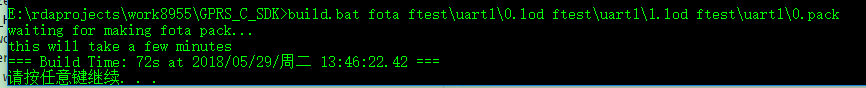

# FOTA使用说明
## 1.整体流程
* 保留旧固件包,如V1_ota.lod
* 生成新的固件包，如V2_ota.lod
* 使用脚本命令生成差异包,如
```
build.bat fota V1_ota.lod V2_ota.lod V1toV2.pack
参数解释：
V1_ota.lod 旧固件所在路径(可相对于build.bat，也可使用绝对路径)
V2_ota.lod 需要更新固件所在路径(可相对于build.bat，也可使用绝对路径)
V1toV2.pack 生成的差异包(放到服务器上的)
```
* 如果没有提示出错，
* 保留生成的pack，可以先通过uart进行本地升级测试，再进行server测试，具体参考代码GPRS_C_SDK\demo\fota\fota_uart.c
* 把生成的pack包放到http文件服务器上
* 修改GPRS_C_SDK\demo\fota\fota_server.c代码中http的url，实现fota
```
        case NETWORK_STATUS_ACTIVATED:
        {
            char url[256];
            memset(url, 0, sizeof(url));
            sprintf(url, FOTA_HTTP_SERVER, SOFT_VERSION);
            Trace(1,"fota network activate success url %s", url);
            if(API_FotaByServer(url, processFotaUpgradeData) == 0)
                Trace(1,"fota wait");
            else
                Trace(1,"fota fail");
            break;
        }
```
## 2.注意事项
* fota使用的是差分包升级,制作的差分包必须要与升级前后的固件为基础,否则升级失败
* 不同版本之间的差分包不同，比如最新版本是D，那么就要用A2D升级原来的A固件,用B2D升级原来的B固件,用C2D升级原来的C固件。